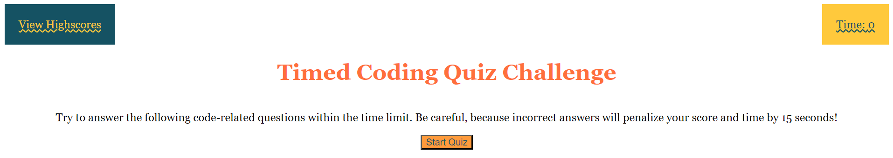

# API-timed-coding-quiz

## Description

This application was designed to be used as a fun way to refresh one's knowledge before going into an interview for potential hire. It is quiz, simple-to-use, and stores one's progress through localStorage to measure their improvement over time.

## Installation

This project is ready-to-use and requires no installation.

## Usage
 
 To start, click the "Start Button" displayed when the application is first loaded, as shown in the display:
 

 Once the start button has been clicked, the timer will begin and the first question will appear with possible answer choices, as shown in the next screenshot. Choose whichever answer you believe to be correct. You will either get awarded a point if correct, or lose 15 seconds on the timer if incorrect.
 

 Once you finish, your final score will be displayed and you can enter your initials, as shown in the following screenshot.
 

 Once your initials are entered, it will direct you to the highscores page where you can view your most recent score and all other scores you have receieved, as shown in the screenshot. If you want to have a fresh start and clear your scores, you can hit the "Clear History" button.
 